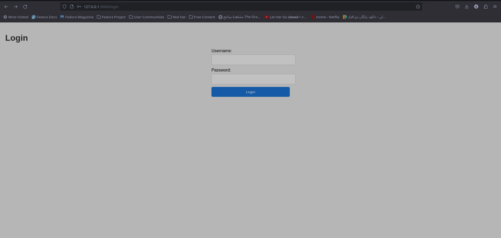
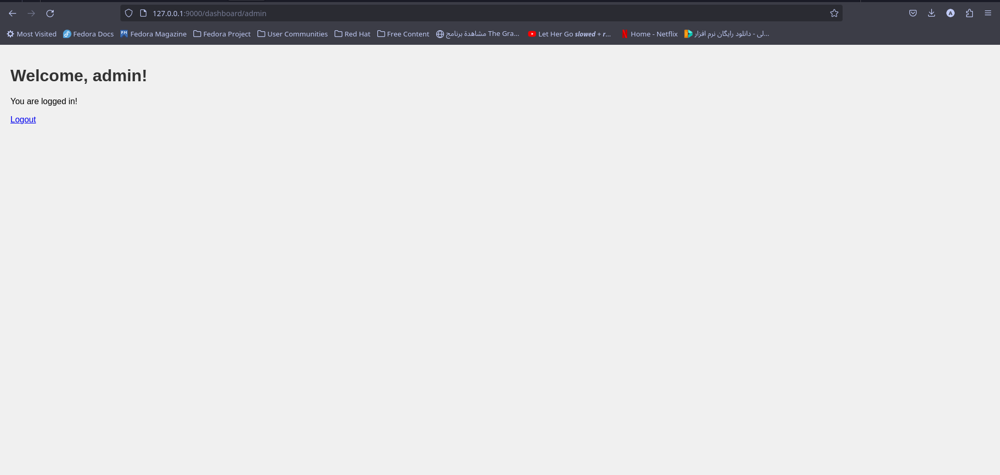

# ERP Battery Store System

Welcome to the **ERP Battery Store System**! This application is a simplified ERP (Enterprise Resource Planning) system designed to manage the various components of a battery store, including users, orders, and processes.

## Features

- **User Authentication:** Login and logout functionalities for users.
- **Dashboard:** A simple dashboard to display a welcome message after successful login.
- **MVC Architecture:** The application is built using the Model-View-Controller (MVC) design pattern for better organization and scalability.

## Project Structure

Here's an overview of the project structure:

```plaintext
project/
│
├── models/
│   └── user.py            # Contains the User class model
│
├── controllers/
│   └── user_controller.py # Contains the UserController class for handling user logic
│
├── views/
│   ├── user_login.html    # HTML template for the login page
│   ├── user_dashboard.html# HTML template for the dashboard page
│   └── style.css          # CSS file for styling the HTML pages
│
└── main.py                # Main entry point for the Flask application
```

# Installation

- To set up this project on your local machine, follow these steps:

1. Clone the repository:
   ```bash
       git clone https://github.com/your-username/ERP-Battery-Store.git
       cd ERP-Battery-Store
   ```
2. Create a virtual environment (optional but recommended):
    ```bash
    python -m venv venv
    ```
3. Activate the virtual environment:

    - Windows:
    ```bash
       venv\Scripts\activate
    ```
    - Mac/Linux:
    ```bash
   source venv/bin/activate
   ```


4. Install the required packages:

```bash
pip install -r requirements.txt
```
- The requirements.txt file should include Flask:

```makefile
    Flask==2.3.4
```
## Usage

1. Run the application:

    ```bash
    python main.py
   ```
2. #### Access the application:<br>
    Open your web browser and navigate to http://localhost:9000/login.

3. #### Login with the following credentials:<br>
        Username: admin
        Password: admin123

    Or use john_doe with password password456 to test as another user.

4. #### After logging in, you'll be redirected to the dashboard page where you will see a welcome message.

## Example Screenshots
1. Login Page

2. Dashboard Page

## MVC Architecture
### Model

- models/user.py: Defines the User class with attributes and a method for password verification.

### Controller

- controllers/user_controller.py: Contains the UserController class to handle user-related logic, such as adding users and verifying login credentials.

### View

- views/user_login.html: HTML template for the login page.
- views/user_dashboard.html: HTML template for the dashboard page.
- views/style.css: Basic CSS for styling the HTML templates.

## Development

Feel free to contribute to this project! You can create a pull request for any improvements or new features. For major changes, please open an issue to discuss it first.
### License
This project is licensed under the MIT License. See the LICENSE file for details.
### Contact
For any questions or feedback, please reach out to your-email@example.com.
### Acknowledgements

- This project is inspired by standard ERP system features and is built for educational purposes.
```
<!DOCTYPE html>
<html lang="en">
<head>
    <meta charset="UTF-8">
    <meta name="viewport" content="width=device-width, initial-scale=1.0">
    <title>ERP System Class Diagram</title>
    <style>
        .class-box {
            border: 1px solid #000;
            padding: 10px;
            margin: 10px;
            display: inline-block;
            vertical-align: top;
        }
        .class-box h2 {
            margin: 0;
            font-size: 16px;
            text-align: center;
            background-color: #f0f0f0;
            border-bottom: 1px solid #000;
            padding: 5px;
        }
        .class-box ul {
            list-style: none;
            padding: 0;
            margin: 0;
        }
        .relationship {
            margin: 10px 0;
        }
        .relationship div {
            display: inline-block;
            width: 30%;
            text-align: center;
        }
        .arrow {
            display: inline-block;
            width: 30%;
            text-align: center;
        }
    </style>
</head>
<body>
    <h1>Class Diagram for ERP System</h1>
    <div class="class-box">
        <h2>Battery</h2>
        <ul>
            <li>+ battery_id</li>
            <li>+ status</li>
            <li>+ quantity</li>
            <li>+ storage_conditions</li>
            <li>+ update_status()</li>
            <li>+ check_conditions()</li>
            <li>+ track_entry_exit()</li>
        </ul>
    </div>
    <div class="class-box">
        <h2>Supplier</h2>
        <ul>
            <li>+ supplier_id</li>
            <li>+ name</li>
            <li>+ contact_info</li>
            <li>+ performance_rating</li>
            <li>+ add_supplier()</li>
            <li>+ update_supplier()</li>
            <li>+ track_order_delivery()</li>
        </ul>
    </div>
    <div class="class-box">
        <h2>Order</h2>
        <ul>
            <li>+ order_id</li>
            <li>+ battery_id</li>
            <li>+ supplier_id</li>
            <li>+ order_date</li>
            <li>+ delivery_date</li>
            <li>+ status</li>
            <li>+ place_order()</li>
            <li>+ update_order_status()</li>
            <li>+ track_delivery()</li>
        </ul>
    </div>
    <div class="class-box">
        <h2>RemanufacturingProcess</h2>
        <ul>
            <li>+ process_id</li>
            <li>+ battery_id</li>
            <li>+ start_date</li>
            <li>+ end_date</li>
            <li>+ status</li>
            <li>+ schedule_process()</li>
            <li>+ track_progress()</li>
            <li>+ ensure_compliance()</li>
        </ul>
    </div>
    <div class="class-box">
        <h2>RecyclingProcess</h2>
        <ul>
            <li>+ process_id</li>
            <li>+ battery_id</li>
            <li>+ start_date</li>
            <li>+ end_date</li>
            <li>+ status</li>
            <li>+ plan_process()</li>
            <li>+ track_progress()</li>
            <li>+ ensure_compliance()</li>
        </ul>
    </div>
    <div class="class-box">
        <h2>QualityControl</h2>
        <ul>
            <li>+ qc_id</li>
            <li>+ battery_id</li>
            <li>+ inspection_date</li>
            <li>+ results</li>
            <li>+ issues</li>
            <li>+ perform_inspection()</li>
            <li>+ maintain_records()</li>
            <li>+ address_issues()</li>
        </ul>
    </div>
    <div class="class-box">
        <h2>Report</h2>
        <ul>
            <li>+ report_id</li>
            <li>+ report_type</li>
            <li>+ generated_date</li>
            <li>+ data</li>
            <li>+ generate_report()</li>
            <li>+ view_report()</li>
            <li>+ analyze_data()</li>
        </ul>
    </div>
    <div class="class-box">
        <h2>User</h2>
        <ul>
            <li>+ user_id</li>
            <li>+ username</li>
            <li>+ password</li>
            <li>+ role</li>
            <li>+ login()</li>
            <li>+ logout()</li>
            <li>+ access_data()</li>
        </ul>
    </div>

    <div class="relationship">
        <div>Battery</div>
        <div class="arrow">-&gt;</div>
        <div>QualityControl</div>
    </div>
    <div class="relationship">
        <div>Supplier</div>
        <div class="arrow">-&gt;</div>
        <div>Battery</div>
    </div>
    <div class="relationship">
        <div>Order</div>
        <div class="arrow">-&gt;</div>
        <div>Battery</div>
    </div>
    <div class="relationship">
        <div>Order</div>
        <div class="arrow">-&gt;</div>
        <div>Supplier</div>
    </div>
    <div class="relationship">
        <div>Battery</div>
        <div class="arrow">-&gt;</div>
        <div>RemanufacturingProcess</div>
    </div>
    <div class="relationship">
        <div>Battery</div>
        <div class="arrow">-&gt;</div>
        <div>RecyclingProcess</div>
    </div>
    <div class="relationship">
        <div>Report</div>
        <div class="arrow">-&gt;</div>
        <div>Battery</div>
    </div>
    <div class="relationship">
        <div>Report</div>
        <div class="arrow">-&gt;</div>
        <div>Supplier</div>
    </div>
    <div class="relationship">
        <div>Report</div>
        <div class="arrow">-&gt;</div>
        <div>RemanufacturingProcess</div>
    </div>
    <div class="relationship">
        <div>Report</div>
        <div class="arrow">-&gt;</div>
        <div>RecyclingProcess</div>
    </div>
    <div class="relationship">
        <div>Report</div>
        <div class="arrow">-&gt;</div>
        <div>QualityControl</div>
    </div>
    <div class="relationship">
        <div>User</div>
        <div class="arrow">-&gt;</div>
        <div>Report</div>
    </div>
</body>
</html>
```